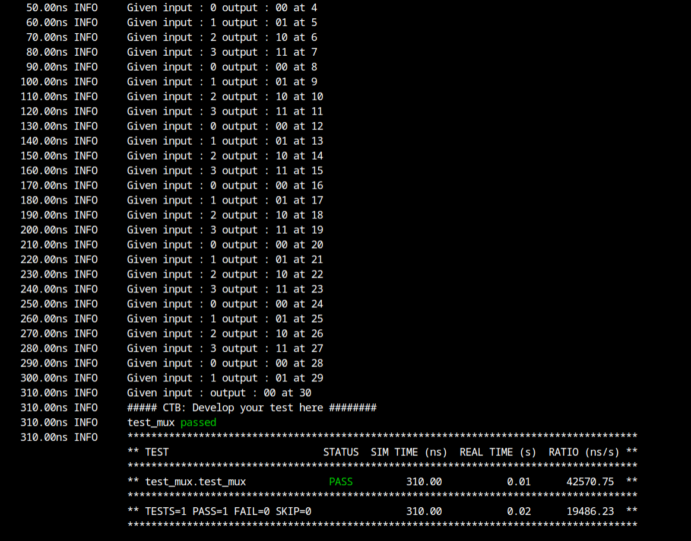

# Adder Design Verification

The verification environment is setup using [Vyoma's UpTickPro](https://vyomasystems.com) provided for the hackathon.


## Verification Environment

The [CoCoTb](https://www.cocotb.org/) based Python test is developed as explained. The test drives inputs to the Design Under Test (mux here) which takes in *31 inp* 1 bit ,and *sel* 5 bit as inputs and outputs *out*.

The values are assigned to the input port using 
```
dut.sel.value=3
dut.inp0.value=0
```

The assert statement is used for comparing the mux
 outut to the expected value.

The following error is seen:
```
 assert dut.out.value == get_value(each=each) ,f"Value at out: {dut.out.value} is not matching with {get_value(each=each)}"
                     AssertionError: Value at out: 00 is not matching with 1
                     assert 00 == 1
```
## Test Scenario **(Important)**
- Test Inputs: inp11=0,inp12=1,sel=12
- Expected Output: sum=1
- Observed Output in the DUT dut.sum=00

Output mismatches for the above inputs proving that there is a design bug

## Design Bug
Based on the above test input and analysing the design, we see the following

```
      5'b01011: out = inp11;
      5'b01100: out = inp12;    --> This is the bug
      5'b01101: out = inp13;
      5'b01110: out = inp14;
```
For the mux design the logic should be 5'b01100: out = inp12; instead of 5'b01101: out = inp12;

## Design Fix
Updating the design and re-running the test makes the test pass.



The updated design is checked in as mux_fix.v

## Verification Strategy

- The verification stategy is to run the test for all the possible inputs and check the output.
- The test is run for all the possible inputs and the output is checked against the expected value.
- When the test fails, the assert statement is printed and the test is marked as failed,assert prints the error message.
- With the help of the assert statement, the error can be debugged.

## Is the verification complete ?

- After the fix the verification is complete.