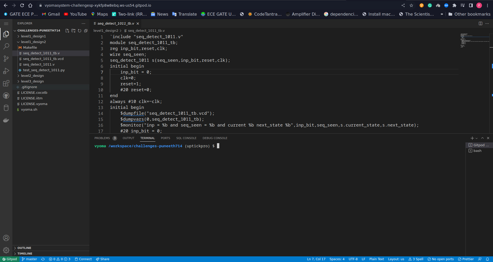
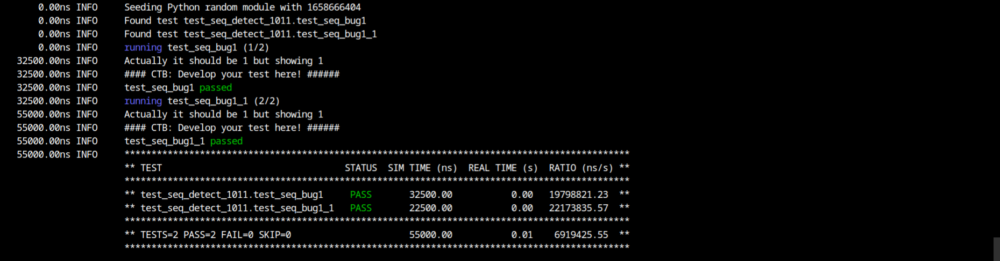

# Adder Design Verification

The verification environment is setup using [Vyoma's UpTickPro](https://vyomasystems.com) provided for the hackathon.



## Verification Environment

The [CoCoTb](https://www.cocotb.org/) based Python test is developed as explained. The test drives inputs to the Design Under Test (seq_detect here) which takes the inputs *inp_bit , reset and clk* and outputs *seq_seen*.

The values are assigned to the input port using 
```
    # Create a 10us period clock on port clk
    clock = Clock(dut.clk, 5, units="us")
    cocotb.start_soon(clock.start())        # Start the clock

    # reset
    dut.reset.value = 1
    await FallingEdge(dut.clk)
    dut.reset.value = 0
    await FallingEdge(dut.clk)
    # vec=BinaryValue(30)
    dut.inp_bit.value = 1
    await FallingEdge(dut.clk)
    dut.inp_bit.value = 1
    await FallingEdge(dut.clk)
    dut.inp_bit.value = 0
    await FallingEdge(dut.clk)
    dut.inp_bit.value = 1
    await FallingEdge(dut.clk)
    dut.inp_bit.value = 1
    await FallingEdge(dut.clk)

```

The assert statement is used for comparing the mux
 outut to the expected value.

The following error is seen:
```
                  assert dut.seq_seen.value == 1, f"Actual seq=1 Result ={dut.seq_seen.value}"
                     AssertionError: Actual seq=1 Result =0
                     assert 0 == 1
```
## Test Scenario **(Important)**
- Test Inputs: inp_bit = 1,1,0,1,1
- Expected Output: seq_seen = 1
- Observed Output in the DUT dut.sum=0

Output mismatches for the above inputs proving that there is a design bug

## Design Bug
Based on the above test input and analysing the design, we see the following

```
    case(current_state)
      IDLE:
      begin
        if(inp_bit == 1)
          next_state = SEQ_1;
        else
          next_state = IDLE;           
      end
      SEQ_1:
      begin
        if(inp_bit == 1)
          next_state = IDLE;              --> Bug
        else
          next_state = SEQ_10;
      end
      SEQ_10:
      begin
        if(inp_bit == 1)
          next_state = SEQ_101;
        else
          next_state = IDLE;
      end
      SEQ_101:
      begin
        if(inp_bit == 1)
          next_state = SEQ_1011;
        else
          next_state = IDLE;              --> Bug
      end
      SEQ_1011:
      begin
        next_state = IDLE;
      end
    endcase
```

**For the sequence detector the logic at first should be next_state=SEQ_1; instead of next_state=IDLE; and the second case should be next_state=SEQ_10; instead of next_state=IDLE;**

## Design Fix
Updating the design and re-running the test makes the test pass.



The updated design is checked in as seq_detect_1011_fix.v

## Verification Strategy

- The verification strategy is to run the test and observe the output.
- The test is run for a range of inputs and the output is observed.
- Their are two tests with one which has inputs just checking if 1011 seq give result as 1.
- The other test has sequence other than the real sequence and the output is observed.
- The second test is passes but the first test fails , for the given design.
- The design is fixed and the test is run again and the output is observed.
- The output is observed and the test is passed.

## Is the verification complete ?

- After the fix the verification is complete.