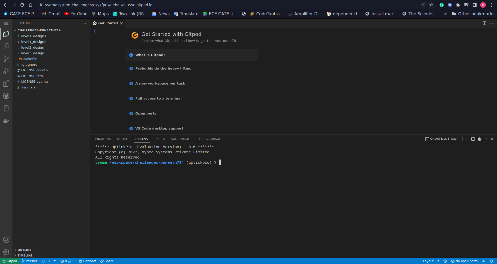
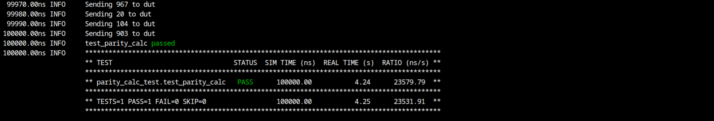

# Adder Design Verification

The verification environment is setup using [Vyoma's UpTickPro](https://vyomasystems.com) provided for the hackathon.



## Verification Environment

The [CoCoTb](https://www.cocotb.org/) based Python test is developed as explained. The test drives inputs to the Design Under Test (mux here) which takes in *stream* 10 bit ,and *clk*  and outputs *out*.

The values are assigned to the input port using 
```
        num = random.randint(0,1023)
        dut.stream.value= num
```

The assert statement is used for comparing the mux
 outut to the expected value.

The following error is seen:
```
assert dut.out.value == bin(num)[2:].count('1') % 2; f"{dut.out.value} is not equal to parity of {bin(num)[2:].count('1') % 2}"
                     AssertionError: assert 0 == (5 % 2)
```
## Test Scenario **(Important)**
- Test Inputs: stream 109(in binary 1101101)
- Expected Output: out 1
- Observed Output in the DUT dut.sum=0

Output mismatches for the above inputs proving that there is a design bug

## Design Bug
Based on the above test input and analysing the design, we see the following

```
    always @(posedge clk)
    begin
        for(i=0;i<WIDTH;i=i+1)
        begin
            tmp=tmp;                --> BUG
        end
        out=tmp;
        tmp=0;
    end
```
For the parity_calc design tmp=tmp should be replaced with tmp=tmp+stream[i];

## Design Fix
Updating the design and re-running the test makes the test pass.



The updated design is checked in as mux_fix.v

## Verification Strategy

- The verification stategy is to run the test for all the possible inputs and check the output.
- The test is run for all the possible inputs and the output is checked against the expected value.
- When the test fails, the assert statement is printed and the test is marked as failed,assert prints the error message.
- With the help of the assert statement, the error can be debugged.
- Here the output function is not implemented properly.


## Is the verification complete ?

- After the fix the verification is complete.